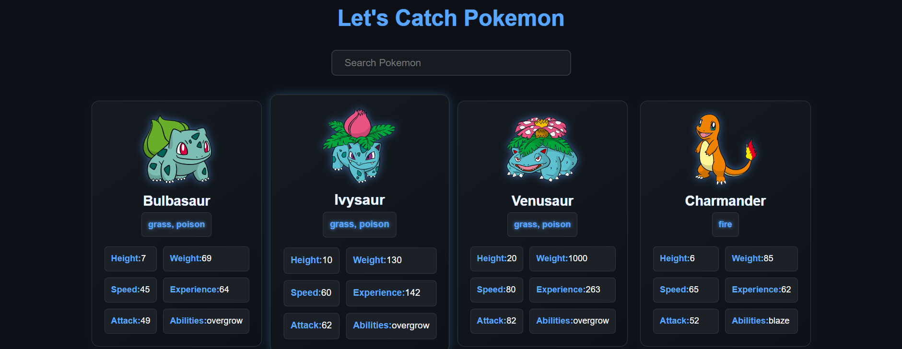
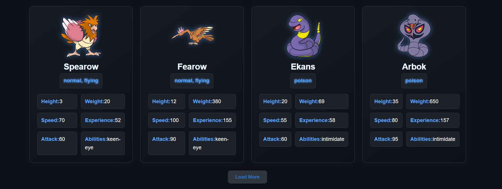

# 🧢 Pokemon App

A React-based Pokémon app that uses the [PokéAPI](https://pokeapi.co/) to fetch and display Pokémon data. Explore your favorite Pokémon, view detailed stats, and search for specific Pokémon in an easy-to-use interface.

🔗 **Live Demo**: [pokemon-api-react.netlify.app](https://pokemon-api-react.netlify.app/)  
📂 **GitHub Repo**: [github.com/TASHFIQ01791/pokemon](https://github.com/TASHFIQ01791/pokemon)

---

## 🌟 Features

- 🔍 **Search Pokémon**: Find any Pokémon by name.
- 📋 **List View**: Display a list of Pokémon with their images and basic info.
- 📊 **Detailed View**: View detailed information like:
  - Type(s)
  - Abilities
  - Base Stats (HP, Attack, Defense, etc.)

---

## 🛠️ Technologies Used

- ⚛️ React
- 📡 PokéAPI
- 💅 CSS / React styling

---

## 📸 Screenshots

Here are some screenshots to give you a quick visual of the app:

---

### 🔹 Search Feature
Search for Pokémon by name.



---

### 🔹 Load More Option
View detailed information like type, abilities, and stats.




## 🚀 Getting Started

### 1. Clone the Repository

```bash
git clone https://github.com/TASHFIQ01791/pokemon.git
cd pokemon
